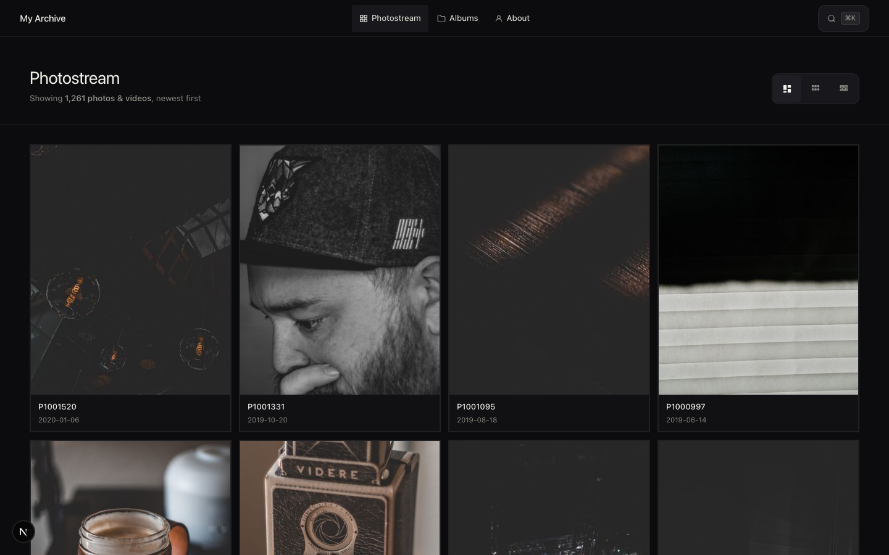
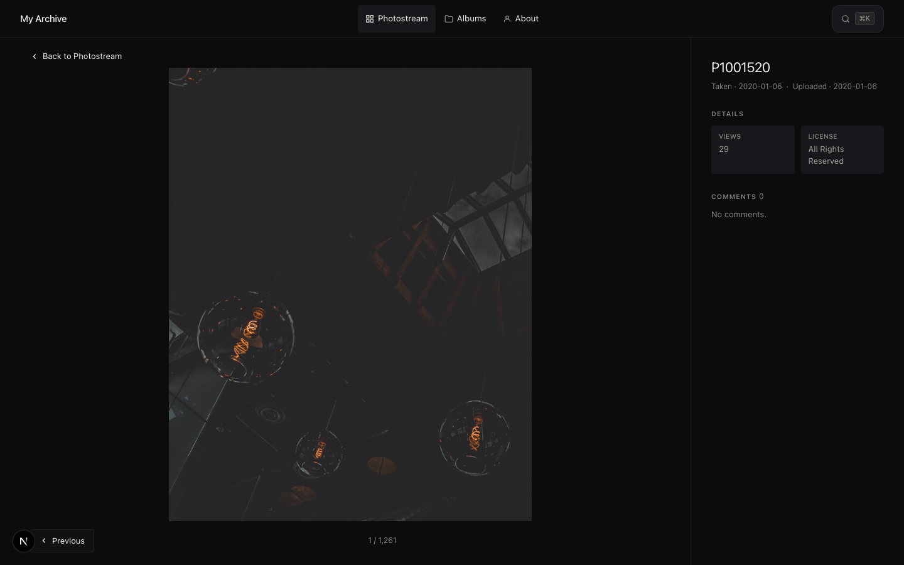
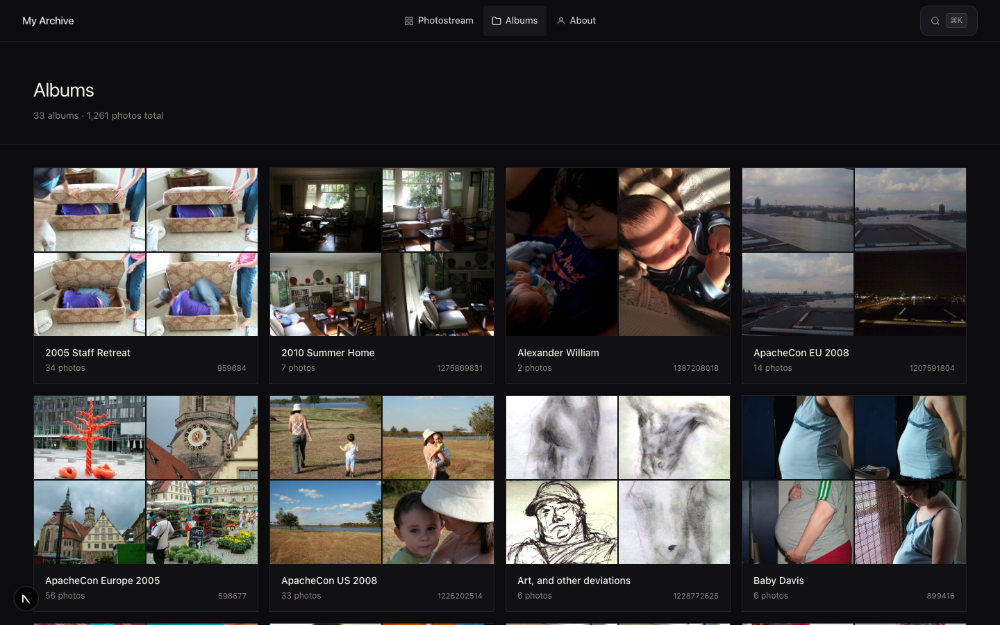
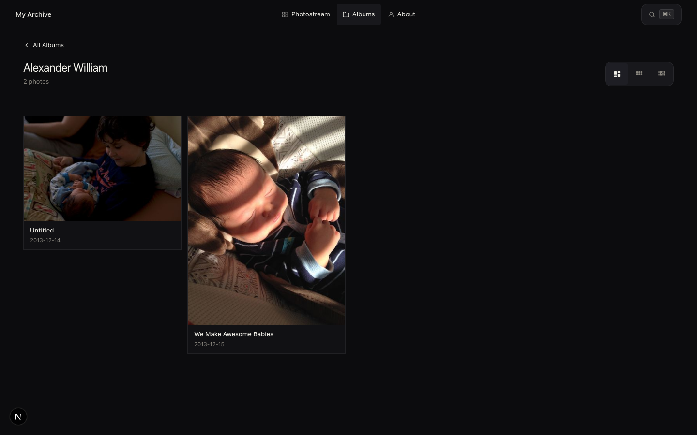
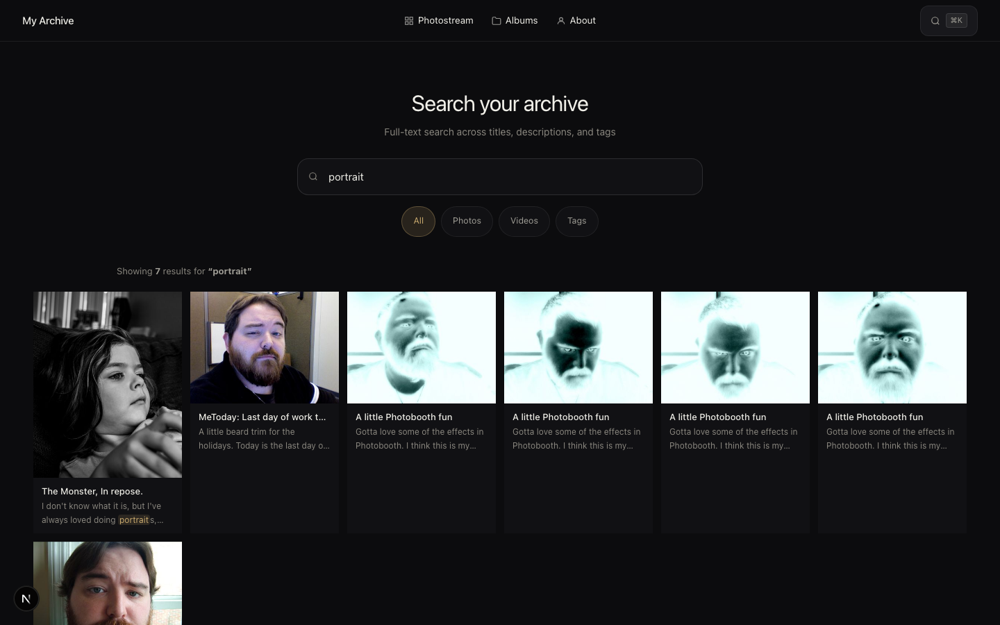
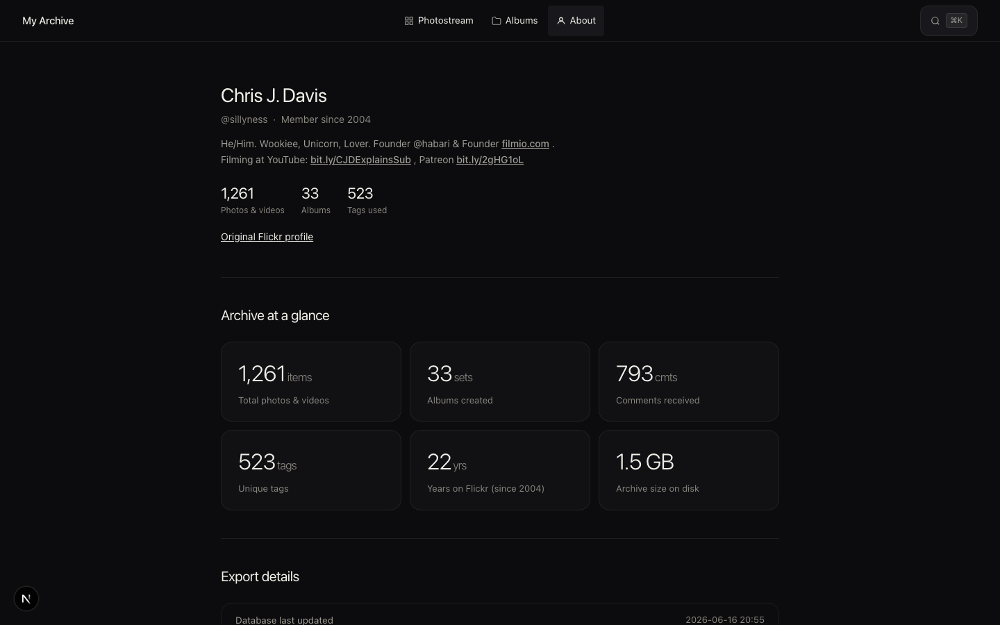
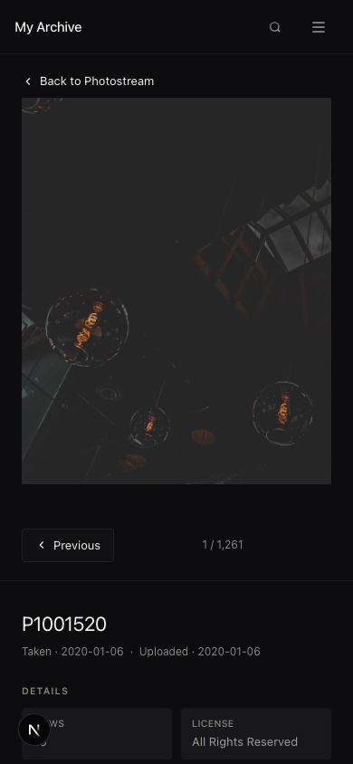

# Flickr Archive

Browse your exported Flickr data locally after leaving Flickr. Import your ZIP export once, then explore your photostream, albums, comments, and tags in a clean read-only web UI.

## Screenshots

**Photostream** — masonry grid with date-sorted photos and adjustable column layout.



**Photo detail** — full-size image with metadata, tags, and comments.



**Albums** — cover previews for every album in your export.



**Album view** — photos in Flickr album order.



**Search** — full-text search across titles, descriptions, and tags.



**About** — archive stats and imported profile info.



**Mobile** — photo detail on a phone-sized viewport.



## Requirements

- Node.js 20+
- A Flickr data export (metadata `*_part1.zip` + `data-download-*.zip` files)

## Quick start

```bash
npm install
cp .env.example .env

# Option A: import in the browser
npm run dev
# Open http://localhost:3000/import

# Option B: import via CLI
npm run import -- /path/to/flickr-export
npm run dev
```

Open [http://localhost:3000](http://localhost:3000).

## Import

### In the app

Go to [http://localhost:3000/import](http://localhost:3000/import) while the dev server is running and upload your Flickr export ZIP files (`*_part1.zip` and `data-download-*.zip`).

### CLI

```bash
npm run import -- /path/to/flickr-export [--output ./archive] [--force]
```

| Flag | Description |
|------|-------------|
| `--output`, `-o` | Archive output directory (default: `./archive`) |
| `--force`, `-f` | Re-import: clears existing media, thumbs, and database |

The import pipeline:

1. Extracts metadata JSON and original media files from your ZIPs
2. Matches `photo_<id>.json` metadata to `*_<id>_o.<ext>` media files
3. Generates JPEG thumbnails for images
4. Builds a SQLite index with FTS5 search over titles, descriptions, and tags

Output layout:

```
archive/
├── index.sqlite
├── media/     # original files from Flickr
└── thumbs/    # generated thumbnails
```

## Environment

```
FLICKR_ARCHIVE_PATH=./archive
IMPORT_ENABLED=true
IMPORT_SECRET=your-long-random-password
```

| Variable | Description |
|----------|-------------|
| `FLICKR_ARCHIVE_PATH` | Archive output directory (default: `./archive`) |
| `IMPORT_ENABLED` | Set to `false` to disable web import entirely. Recommended on public servers after the archive is built. Defaults to enabled. |
| `IMPORT_SECRET` | Required in production while web import is enabled. Hides Import from the public nav and requires this password at `/import`. Leave unset for local development only. |

For local development, leave `IMPORT_SECRET` unset and import works without a password. **Production servers refuse to start without `IMPORT_SECRET` unless `IMPORT_ENABLED=false`.** After importing, set `IMPORT_ENABLED=false` and restart to remove the import UI and API entirely. CLI import (`npm run import`) still works over SSH regardless of this setting.

### Security notes

- Upload size is capped at 2 GiB per file and 10 GiB per session (see `src/lib/import-limits.ts`).
- ZIP extraction validates paths and limits uncompressed size to prevent zip-slip and zip bombs.
- Import password attempts are rate-limited (8 per 15 minutes per IP).
- Place a reverse proxy body size limit in front of the app for defense in depth.

## Routes

| Route | Description |
|-------|-------------|
| `/` | Photostream (newest first, paginated) |
| `/photos/[id]` | Photo detail with tags and comments |
| `/albums` | Album list |
| `/albums/[id]` | Album grid |
| `/search?q=` | Full-text search |
| `/about` | Imported profile and stats |
| `/import` | Upload Flickr export ZIPs |

## Scripts

```bash
npm run dev        # Start dev server
npm run build      # Production build
npm run start      # Start production server
npm run import     # Import Flickr export
npm run test       # Run tests
npm run typecheck  # TypeScript check
```

## Testing

```bash
npm test
```

Tests cover photo ID matching, JSON parsing, and a full mini-import fixture.

## What's not included (Week 1)

- Public user authentication
- Map/geotags, groups, contacts, Flickr Mail
- EXIF panel
- Static export / Docker

## License

Apache License 2.0. See [LICENSE](LICENSE).
